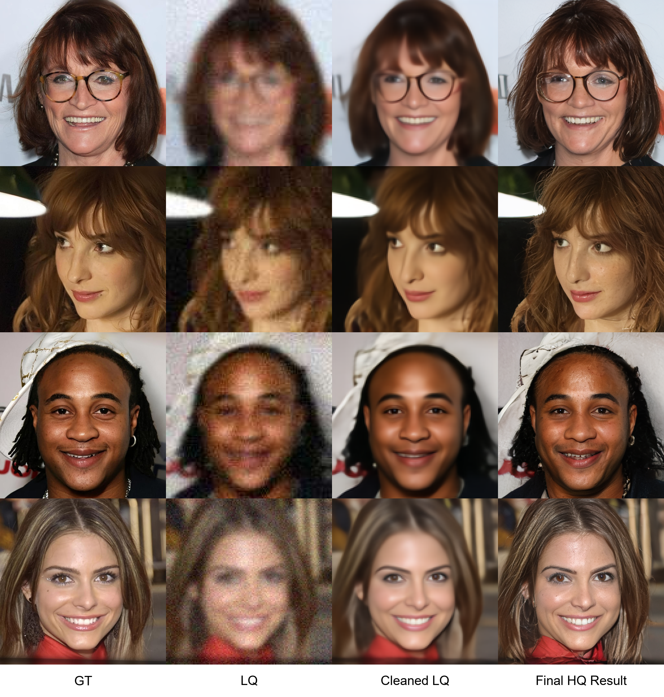
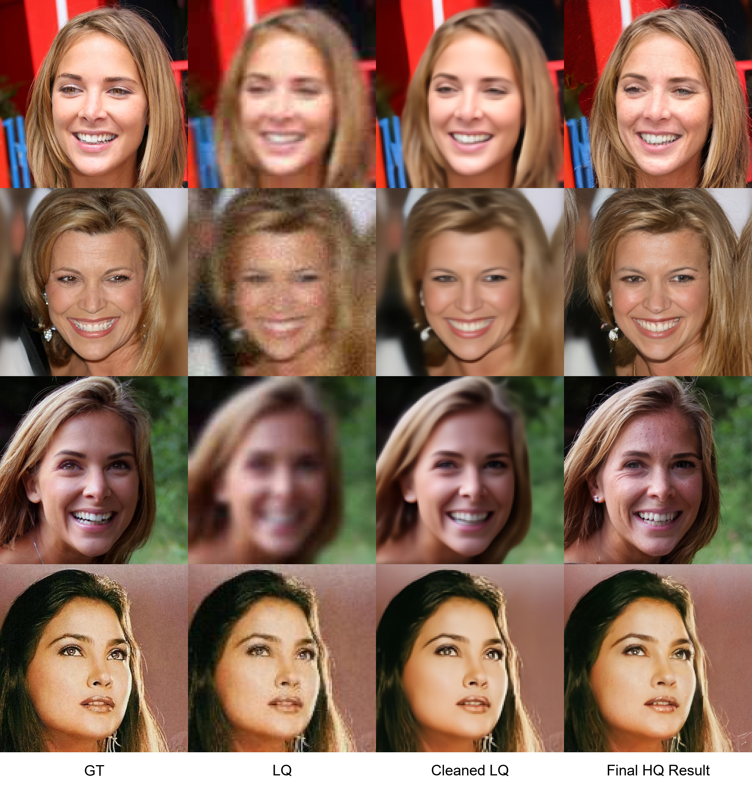
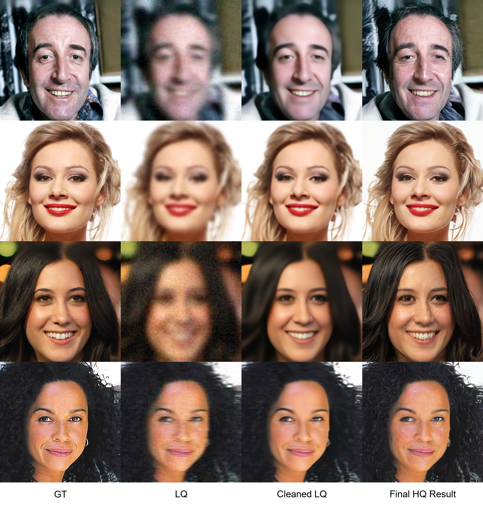
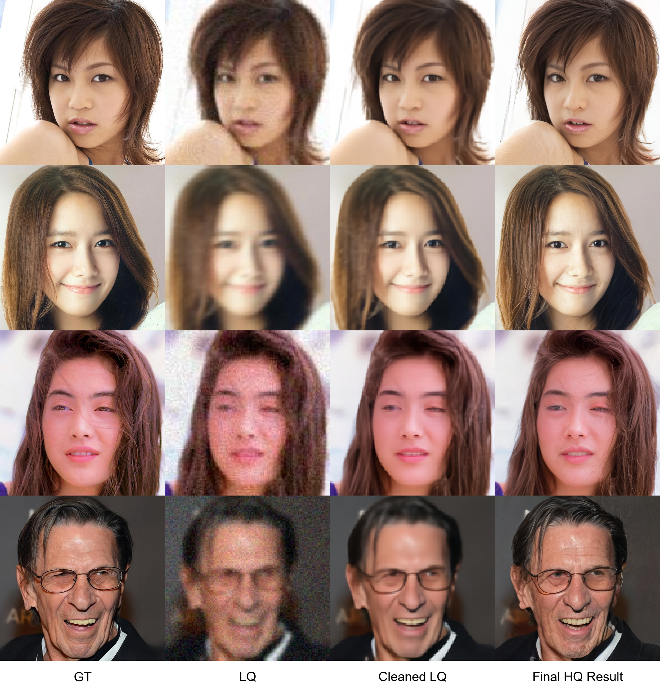
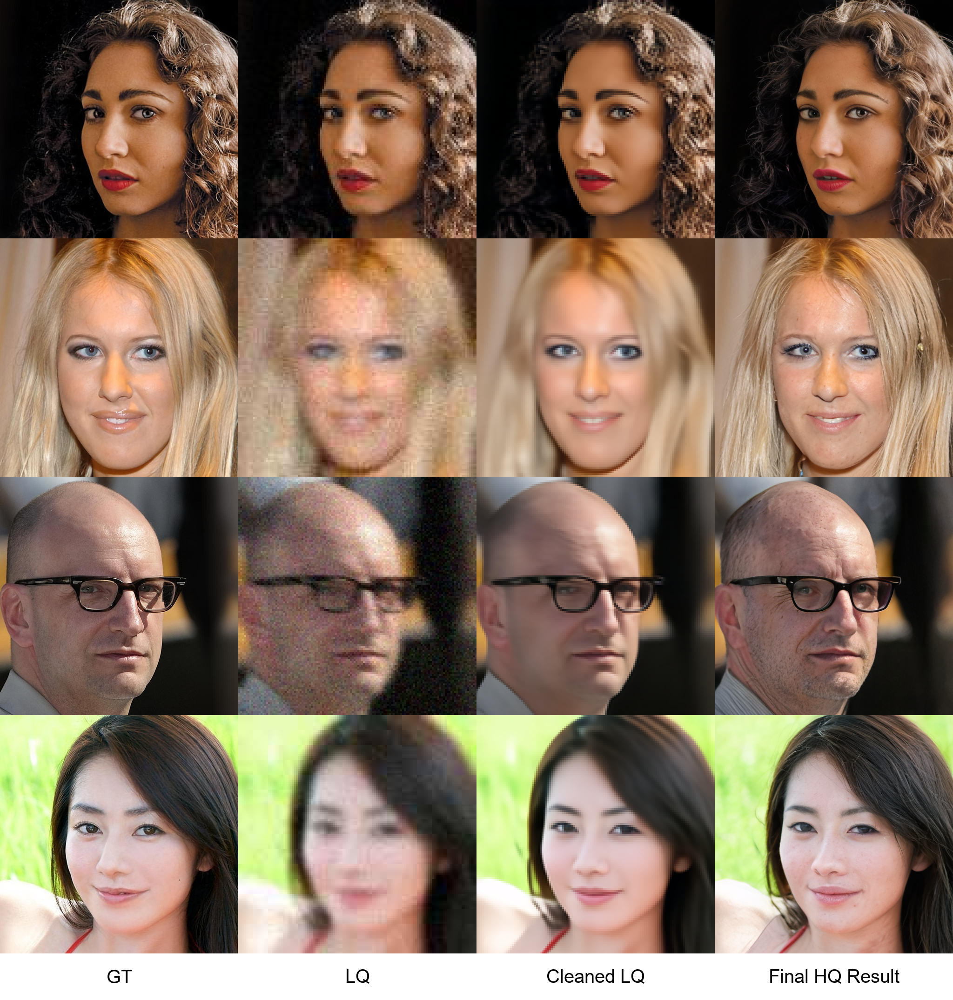
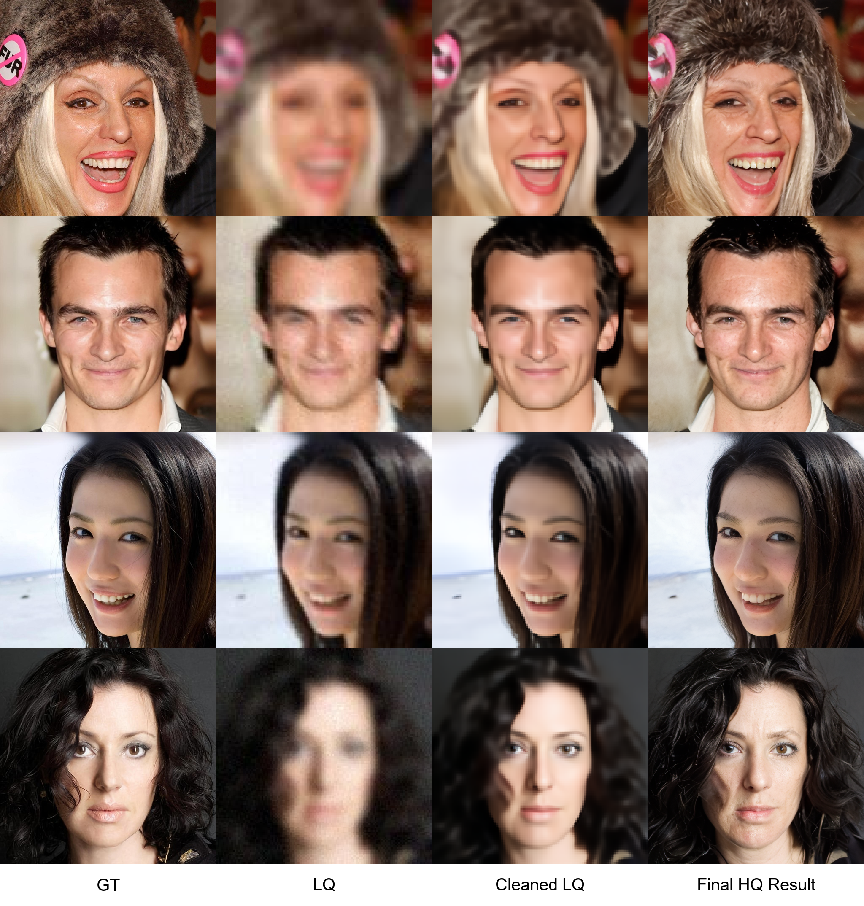

# SwinShiftSR

This project focuses on face image super-resolution for noisy low-resolution images.

The proposed method combines SwinIR and ResShift to reduce noise and restore facial details, producing clearer and more natural high-resolution face images.

## Results

From left to right, each result contains:

1. **GT**: the original ground-truth image.
2. **LQ**: the low-quality image after noise degradation.
3. **Cleaned LQ**: the denoised image generated by the first stage.
4. **Final HQ Result**: the final high-resolution image generated by the second stage.

The original resolutions of **LQ** and **Cleaned LQ** are `128 × 128`. For easier visual comparison, all images are displayed at the same size below. The resolution of the **Final HQ Result** is `512 × 512`.

